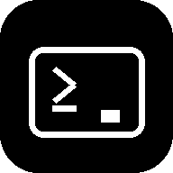

**SSH COMMANDER**

---

**SSH Commander** — a powerful SSH/SFTP client with terminal, widgets, and biometric authentication.

> **Current version:** 1.5 — first-run setup & in-app guide, Windows & Linux support.


SSH Commander is a powerful and user-friendly cross-platform client for remote server management via SSH and SFTP — available on **Android**, **Windows**, and **Linux**. Built for system administrators, DevOps engineers, and anyone who works with remote servers.

## Features

### Persistent Background Sessions (New in 1.7.0)
- **Session Continuity** — connections now live in a global `SessionManager`. Navigate to settings or switch apps without losing your SSH/SFTP connection.
- **Android Background Support** — stable connections that survive UI recreation and system navigation.
- **Smart Auto-reconnect** — intelligent retry logic with exponential backoff (2s, 4s, 8s...) to handle flickering networks.

### Smart Workspaces & Tabs
- **Workspaces** — save your entire environment (open servers, specific SFTP paths, and last commands) and restore it with one tap.
- **Global Sync** — workspaces are now part of the backup and cloud sync, appearing on all your devices.
- **Session Tabs** — run multiple independent sessions per server (use the "+" button).
- **Organization** — pin tabs and assign colors (e.g., Red for Production, Blue for Development).

### Cross-Platform SFTP Manager
- **Unified Engine** — a completely redesigned SFTP core that works identically on Android (SAF) and Desktop.
- **In-place Editor** — edit configuration files directly on the server and save instantly.
- **Smart Transfers** — reliable upload/download with progress tracking and multi-file support.
- **Remote Preview** — view text, JSON, and images without downloading them first.
- **Manual Navigation** — quick jump to any path via keyboard entry.

### Identity Master & SSH Keys
- **Unified Identities** — manage login credentials and SSH keys in one place.
- **Key Generator** — create secure RSA-4096 or Ed25519 keys directly in the app.
- **Auto-Provisioning** — automatically deploy your public keys to remote servers with one click.
- **Host Key Verification** — protection against Man-in-the-Middle attacks.

### Monitoring & Command Center
- **Real-time Dashboard** — widgets for CPU, RAM, and Disk usage + live log streaming (`tail -f`).
- **Smart Snippets** — custom commands with variable support `{{var}}` and category filtering.
- **Home Screen Widgets** — (Android) check server status and run commands without opening the app.

### 🛡 Security & Privacy
- **Biometric Lock** — secure the app with Fingerprint or Face ID.
- **Secure Storage** — encryption of all sensitive data using system-level providers (DPAPI on Windows).
- **Privacy Mode** — mask IP addresses in lists for safe presentations or screenshots.

## Platforms

- **Android** — full-featured mobile client with home-screen widgets and biometric lock.
- **Windows** — desktop client with resizable panes, Terminal+SFTP split view, and MSI/EXE installers.
- **Linux** — desktop client for Linux systems (tested on Debian/Ubuntu), supports DEB and RPM packages.

## Requirements

- **Android 7.0** (API level 24) or higher.
- **Windows 10** or higher.
- **Linux** (modern distributions like Ubuntu 22.04+, Debian 11+, etc.).

## Installation

### From GitHub Releases
1. Go to [Releases](https://github.com/Neytron951/SSHCommander/releases)
2. Download the latest `.apk` (Android), `.msi`/`.exe` (Windows), or `.deb`/`.rpm` (Linux)
3. Install

### From Source
```bash
git clone https://github.com/Neytron951/SSHCommander.git
cd SSHCommander

# Android app (modern Compose Multiplatform version)
./gradlew :androidApp:assembleDebug

# Android app (legacy native version)
./gradlew :appLegacy:assembleDebug

# Windows desktop app (MSI or EXE installer)
./gradlew :desktopAppWindows:packageMsi
./gradlew :desktopAppWindows:packageExe

# Or build both installers with the interactive script
build-windows.bat

# Windows desktop app — unpacked folder
./gradlew :desktopAppWindows:createDistributable

# Run desktop app for development
./gradlew :desktopAppWindows:run
./gradlew :desktopAppLinux:run

# Build Linux packages (DEB or RPM)
./gradlew :desktopAppLinux:packageDeb
./gradlew :desktopAppLinux:packageRpm

# Tests
./gradlew :shared:desktopTest
```
