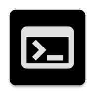
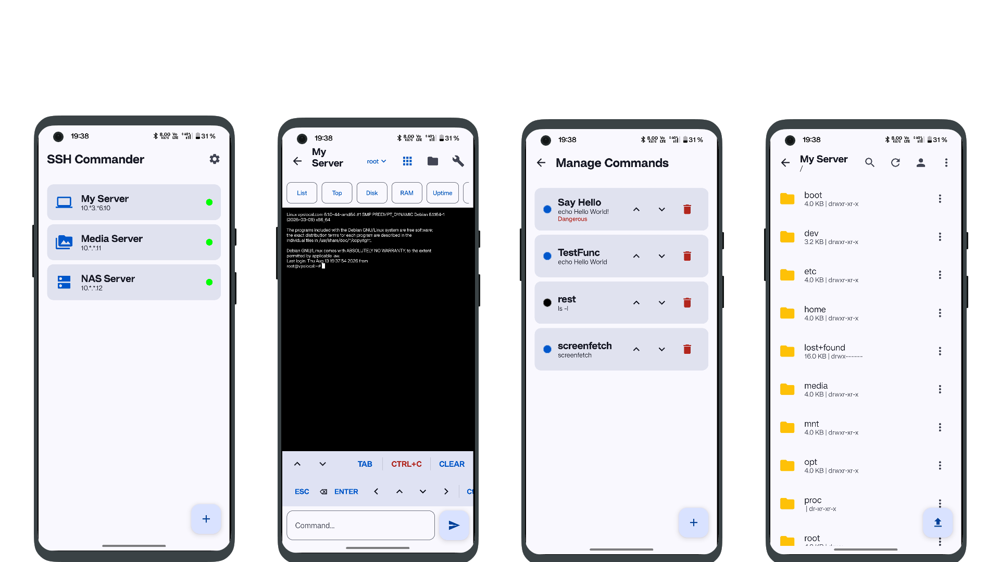

# SSH COMMANDER

---

**SSH Commander** — a powerful SSH/SFTP client with terminal, widgets, and biometric authentication.



SSH Commander is a powerful and user-friendly client for remote server management via SSH and SFTP. Built for system administrators, DevOps engineers, and anyone who works with remote servers.

## Features

### Full-Featured Terminal
- Full VT100/ANSI emulation with color support — nano, vim, htop work flawlessly
- Control key panel: ESC, arrow keys, TAB, Ctrl+X/O/G/W/K
- Key hold with auto-repeat, block cursor, auto-scroll
- Customizable font and text size for comfortable work

### SFTP File Manager
- Browse and navigate server file structure
- Upload and download files, create folders, rename and delete
- File search, show hidden files, multi-select
- Configurable startup folder for quick access

### Quick Commands & Widgets
- Ready-to-use commands: df -h, free -m, htop, uptime, ps aux, tail -f
- Create custom commands with confirmation and biometric authentication for dangerous actions
- Home screen widget: server status (online/offline) and quick command execution

### Security
- App lock with fingerprint or Face ID
- Host key change verification (Man-in-the-Middle protection)
- Privacy mode — hide part of IP addresses in the list

### Flexibility & Settings
- Unlimited number of servers with grouping by categories and icons
- Multiple logins per server
- Light and dark theme, terminal appearance customization
- Auto-reconnect on connection drop
- Backup & restore (JSON export/import)
- English and Russian language support

## Requirements

- **Android 7.0** (API level 24) or higher

## Installation

### From GitHub Releases
1. Go to [Releases](https://github.com/Neytron951/SSHCommander/releases)
2. Download the latest `.apk` file
3. Install on your Android device (allow installation from unknown sources)

### From Source
```bash
git clone https://github.com/Neytron951/SSHCommander.git
cd SSHCommander
./gradlew assembleDebug